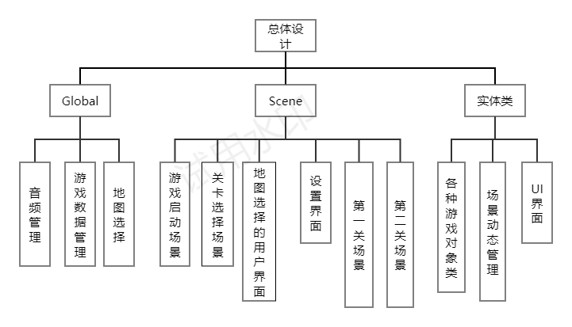

这是程序设计范式的期末作业，我们用了近一个月的时间，开发了基于Cocos2d-x的《保卫萝卜》游戏。
# 项目分工 #

1. 郑淑涵（组长）（占比：30%）：主要完成实体类monster、obstacle、carrot设计，enititylayer类、uilayer的内容，以及防御塔、怪物、萝卜等实体类的动画效果。

2. 李杜若（占比：40%）：完成两张实体地图创建、游戏初始化界面以及关卡选择界面，实现背景音乐功能（包括攻击、建造、击杀时的音效），保存通关进度记录功能，以及中途退出时记录当前状态，下次进⼊同⼀关卡继续上一次游戏进程的功能，以及monster基类设计。
3. 刘笑云（占比：30%）：完成实体类tower和bullet的设计，以及enitylayer、uilayer的设计和部分内容，完成项目合并和整体框架的搭建。
#功能实现#
游戏设计中我们基本还原了《保卫萝卜》的功能，支持选择、闯关等多种场景。
-  
## 1. 游戏模式和关卡选择 ##
 

1. 在游戏场景初始化界面，我们还原了原版游戏界面并实现动画效果如萝卜抖动、怪物摆动等，并提供三种模式选择按钮，目前仅支持“冒险模式”。

1. 进入“冒险模式”后，玩家可以自主切换查看三种类型的地图，支持前两种地图选择，选择地图后进入“选择关卡”界面，支持保存通关进度记录功能，玩家可以选择已解锁的关卡，按下开始按钮后正式进入游戏闯关。
## 2. 游戏闯关 ##
1. 闯关模式中，共支持五波共三种类型的怪物，怪物吃到萝卜会减少萝卜的生命值。
2. 玩家可以在任意位置选择建造三种类型的防御塔，支持发射物攻击特效，并随时可以毁灭防御塔。若金币充足，支持升级防御塔，最高级别为3级。
3. 防御塔可以选定攻击怪物或者障碍物，目标击灭后可以获取相应的金币值奖励，用于升级防御塔。
4. 若怪物全部消灭，则游戏胜利，否则若萝卜生命值在怪物全部击灭前减为0，游戏失败。游戏结束后会显示胜利/失败局面，玩家可以自主选择重新开始或者选择关卡。此外，在游戏中途，玩家可以选择暂停/继续游戏，或者按下菜单按钮后选择退出游戏或者重新开始，若中途退出时记录当前状态，下次进入同一关卡可以继续上一次游戏进程的功能。
#项目设计#
游戏设计满足C++面向对象设计原则，全部使用类的设计开发。

# 游戏实现特色 #
我们在选择游戏素材基本全部使用《保卫萝卜》原版素材，较高程度地还原了原版游戏。游戏界面实现流程，支持功能全面，可以带给玩家较好的用户体验。
# C++特性#
##STL容器##
STL容器提供了高效、灵活且易于使用的数据结构，能够大大简化代码的编写和维护。在项目类的设计中，多处使用了STL容器减少操作复杂性、提升效能。
在AudioManager类（音频资源管理类）中，使用了std::unordered_map 来存储音效文件路径，方便高效地查找音频。在Setting类（设置界面类）中。使用std::array储存控制按钮的名称和指针，保证了按钮名称的固定大小。在entitylayer类（实体储存类）中，使用std::vector储存各类游戏对象实体，方便动态增加和删除游戏中实时变化的对象。
STL容器在项目设计中扮演了至关重要的角色，通过其高效性和灵活性，不仅减少了代码的复杂性，还提高了代码的可维护性和执行效率。通过这种方式，开发团队能够更专注于实现核心功能，而将数据结构的管理交给高效、可靠的STL容器，大大提升了项目的开发效率和质量。
##异常处理机制##
异常处理机制在C++中是一个强大的特性，用于管理程序中的错误和异常情况，确保程序能够在发生错误时进行适当的处理，而不会导致程序崩溃或不稳定。在项目设计过程中，我们也充分利用了异常处理机制来预见和捕获潜在的异常情况，方便调试和排查错误。
如在ChineseWord类（处理中文类）中使用try-catch 来捕获 std::out_of_range 异常，允许程序在遇到无法找到的key 时不崩溃，而是返回一个错误信息，并记录异常，增强了程序的鲁棒性。以及在创建游戏对象时使用std::nothrow，让内存分配失败时不抛出异常，确保程序在异常情况下能够优雅地处理错误。
## 迭代器 ##
迭代器是一种通用的访问容器元素的工具，它提供了对容器中元素的统一访问方式，不依赖于容器的底层实现，提升代码的通用性、灵活性，避免直接使用容器索引可能带来的错误。
在entitylayer类中需要对游戏实体进行多次遍历，使用了迭代器来简化这一操作，如使用了std::vector 的范围基于循环遍历对象，避免显式地使用迭代器或索引来访问容器元素，但实际底层通过迭代器来访问容器中的每个元素。
##智能指针##
智能指针通过封装裸指针的方式，自动管理对象的生命周期，可以减少手动内存管理带来的问题。如在游戏资源管理中，使用了unique_ptr 来管理数据库资源，让代码更加安全。

